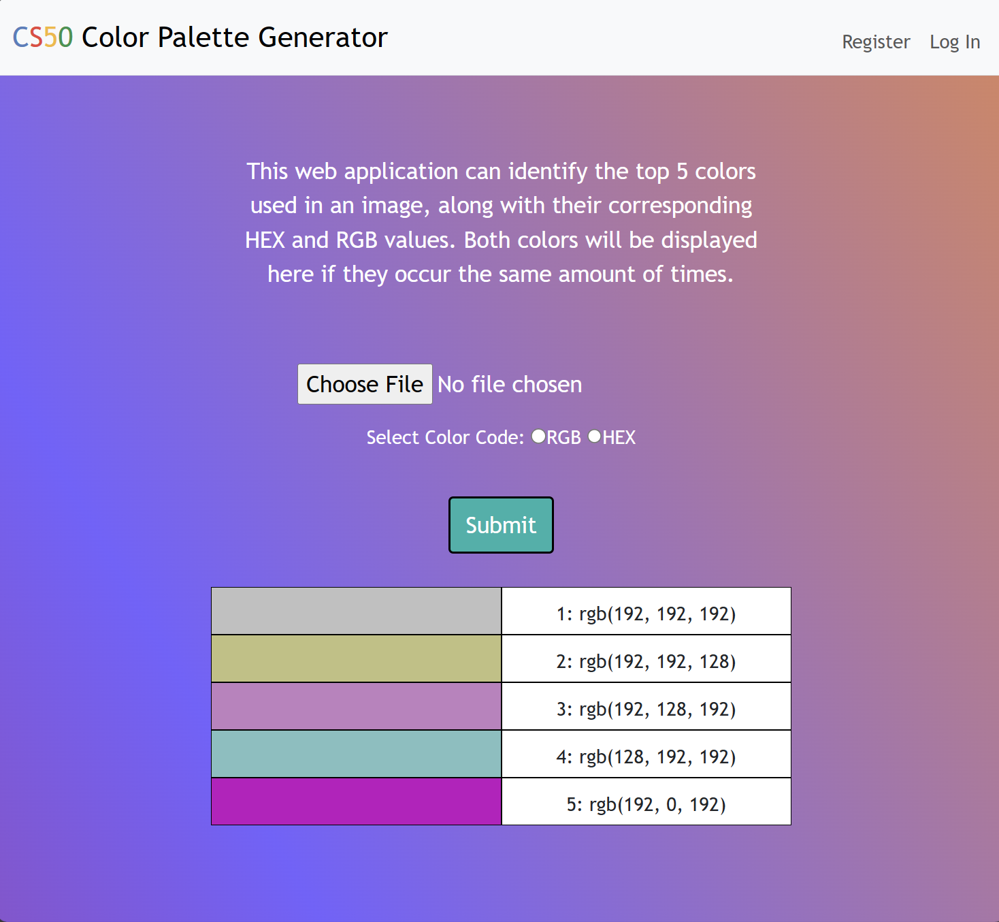

# Project Title: CS50 Color Palette Generator

---

#### Video Demo: [Click hear!](https://youtu.be/dQNWml8M-n0)

#### Description:
This web application is developed using Python with Flask as the framework. It generates RGB and HEX values for the top 5 colors present in the user's uploaded image.

# Libraries used:

>**In project.py**

* [**SQL from CS50**](https://cs50.readthedocs.io/libraries/cs50/python/#cs50.SQL)
* [**redirect, render_template, and request from Flask**](https://flask.palletsprojects.com/en/3.0.x/)
* [**Session from flask_session**](https://flask.palletsprojects.com/en/3.0.x/)
* [**check_password_hash and generate_password_hash from werkzeug.security**](https://werkzeug.palletsprojects.com/en/3.0.x/utils/)
* [**Image and ImageOps from Pillow**](https://pillow.readthedocs.io/en/stable/)
* [**datetime**](https://docs.python.org/3/library/datetime.html)
* [**Numpy**](https://numpy.org/doc/stable/user/)
* [**JSON**](https://docs.python.org/3/library/json.html)

# How this Project Works?

Users can upload an image file through a simple form on the website. The Python program reads this file, converts it to a NumPy matrix, filters out unique colors, counts the occurrences of these unique values, and then returns the RGB or HEX values of the top 5 most occurring colors. Additionally, users can register for an account to access their recently generated color palettes in the "History Tab".

>**Sample Output of the Project**

# Contents of the project

The project folder contains the following files:

>**flask_session folder**

A session represents the time between when the client logs into the server and logs out. Data needed to be preserved in the session is stored in a temporary directory on the server.

>**static folder**

This folder contains assets used by the templates, including CSS files and images. The project comprises the following files:

* **_favicon.ico_** - A favicon is an icon that appears at the top of a browser tab. Although they are not required, favicons are important because they help the user identify your site.

* **_style.css_** - it is responsible on how HTML elements are to be displayed on screen.

>**templates folder**

The templates folder contains only templates. These have an .html extension. As we will see, they contain more than just regular HTML.

* **_apology.html_** - it is responsible for catching an error, displaying its description, and presenting a cat meme generated in response to the error.

* **_history.html_** - it is responsible for displaying the recently generated color palettes by the user.

* **_index.html_** - this is the main page of my web application.

* **_layout.html_** - this is the main HTML file of the web application, responsible for serving as the template for other HTML files.

* **_login.html_** - it is responsible for displaying the login form for the users.

* **_register.html_** - it is responsible for displaying the registration form for the users.

>**app.py**

This is the main python file where all of the code has been written. It consist libraries that have been used and has multiple functions, which will be explained as follows:

>**helpers.py**

"Helpers.py" typically refer to functions or classes that are designed to assist or support other parts of a program. These helpers can perform specific tasks or provide useful functionality that can be reused in different parts of the code.

>**users.db**

Databases are employed for storing, maintaining, and accessing various types of data. In this project, 'users.db' is utilized to store user usernames and passwords, along with their activities while using the web app.

>**requirements.txt**

All of the pip-installable libraries in my project are listed in this file.

>**README.md**

This is a text file that introduces and explains my project. It contains information that is commonly required to understand what the project is about.

# How to run the program?

---

1. Make sure your python version is up-to-date.
2. Clone the project code. [Click here](https://github.com/code50/142967173/blob/main/project/project.py)
3. Make sure to import and install all pip-installable libraries in "requirements.txt" file.
4. With all of the above completed, type "flask run" in your terminal and click the link! Enjoy!
"# CS50X-Final-Project" 
